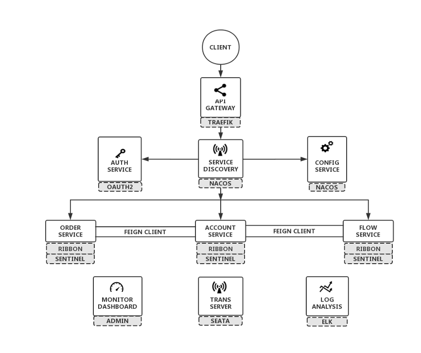

# wk8-springblade
https://gitee.com/smallc/SpringBlade

The open source project SpringBlade is a mature, open-source distributed microservice framework, referring to the Fig.1 architecture diagram below.

Fig.1 Microservice

