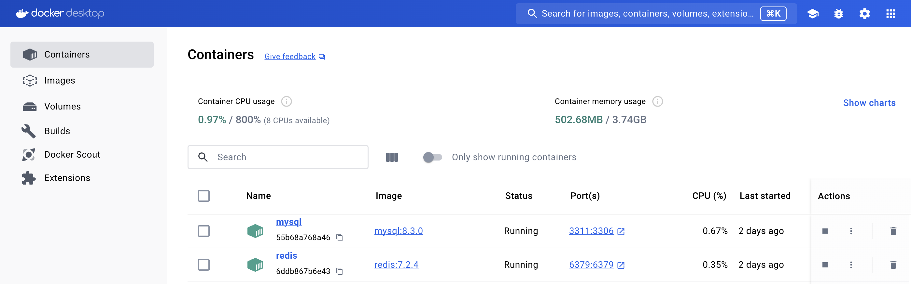

# wk8-springblade
https://gitee.com/smallc/SpringBlade

The open source project SpringBlade is a mature, open-source distributed microservice framework, referring to the Fig.1 architecture diagram below.

Fig.1 Microservice

首先，docker配置redis, mysql运行。运行结果如下：

环境配置如下：
- Docker version 27.0.3
- MySQL version 8.3.0
- Redis version 7.2.4
- Docker Desktop ([Download for Mac](https://desktop.docker.com/mac/main/arm64/Docker.dmg?utm_source=docker&utm_medium=webreferral&utm_campaign=docs-driven-download-mac-arm64&_gl=1*jv0n7i*_ga*ODAzMTczNzEzLjE3MjI4MzQ0NDg.*_ga_XJWPQMJYHQ*MTcyMzE5MTQyOS4zLjEuMTcyMzE5MTQ0NC40NS4wLjA.))
- MySQLWorkbench ([Download for Mac](https://dev.mysql.com/downloads/file/?id=528776/))
- Redis Desktop Manager([Download for Mac](https://pan.baidu.com/s/10vpdhw7YfDD7G4yZCGtqQg?_at_=1673701651004/))

运行指令如下：
Run SpringBlade Application.java
