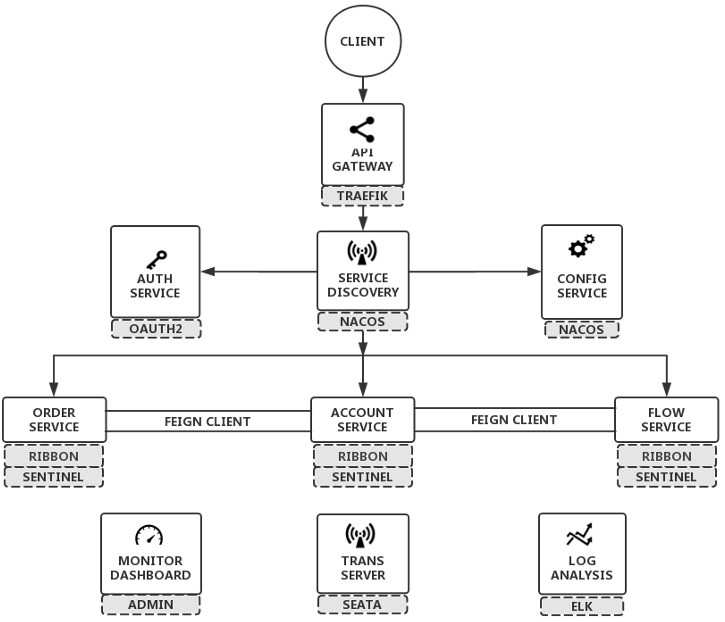
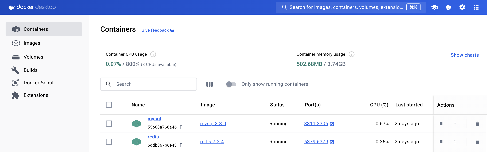
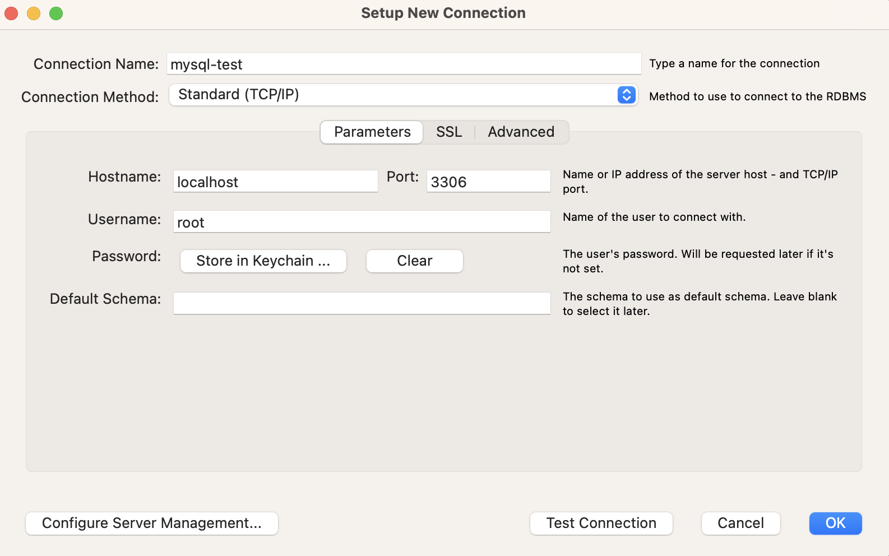
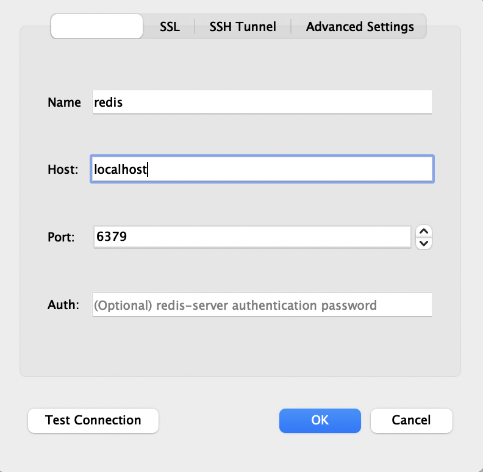
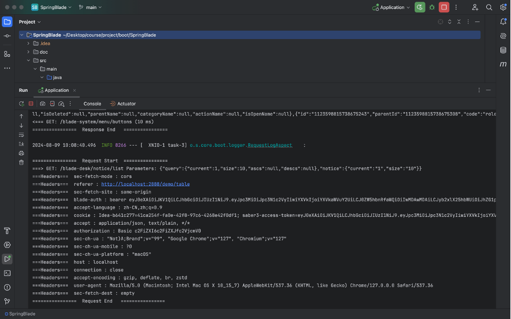
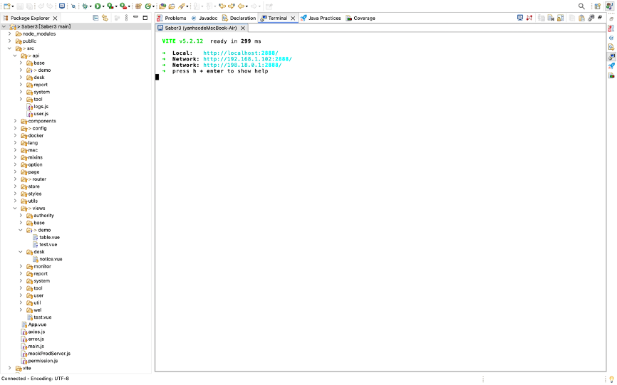

# wk8-springblade
https://gitee.com/smallc/SpringBlade

The open source project SpringBlade is a mature, open-source distributed microservice framework, referring to the Fig.1 architecture diagram below.


<p style="text-align: center;">Fig.1 Microservice</p>

**Step1**, configure redis& mysql(Fig.3-4) in DockerDesktop, as followed by the Fig.2 below. And run SpringBlade, as followed by the Fig.5.
<div style="text-align: center;">
    
    <p style="margin: 0;">Fig.2 Docker</p>
</div>
<div style="text-align: center;">
    
    <p style="margin: 0;">Fig.3 MySQL(should you see the successful configuration, click "TestConnection")</p>
</div>
<div style="text-align: center;">
    
    <p style="margin: 0;">Fig.4 Redis(should you see the successful configuration, click "TestConnection")</p>
</div>
<div style="text-align: center;">
    
    <p style="margin: 0;">Fig.5 SpringBlade</p>
</div>


- Docker version 27.0.3
- MySQL version 8.3.0
- Redis version 7.2.4
- Docker Desktop ([Download for Mac](https://desktop.docker.com/mac/main/arm64/Docker.dmg?utm_source=docker&utm_medium=webreferral&utm_campaign=docs-driven-download-mac-arm64&_gl=1*jv0n7i*_ga*ODAzMTczNzEzLjE3MjI4MzQ0NDg.*_ga_XJWPQMJYHQ*MTcyMzE5MTQyOS4zLjEuMTcyMzE5MTQ0NC40NS4wLjA.))
- MySQLWorkbench ([Download for Mac](https://dev.mysql.com/downloads/file/?id=528776/))
- Redis Desktop Manager([Download for Mac](https://pan.baidu.com/s/10vpdhw7YfDD7G4yZCGtqQg?_at_=1673701651004/))

**Commands**:

Run SpringBlade Application.java

**Step2**, run Vue3, as followed by Fig.6.
<div style="text-align: center;">
    
    <p style="margin: 0;">Fig.6 Vue3</p>
</div>

**Commands**:

```sh
yarn install
yarn run dev

